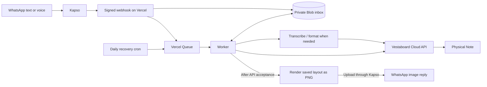

# WhatsApp → Vestaboard Note

Send a WhatsApp text or voice note. It appears on your **physical Vestaboard Note**.

A small, self-hosted bridge built with plain JavaScript, Kapso and Vercel. It runs in the cloud; your laptop can be off. Each installation uses its **own accounts, phone number, board, keys and storage**. There is no shared backend or bundled access to someone else's board.

## What it does

- Accepts messages only from the WhatsApp numbers you allow.
- Wraps short messages without AI. Rewrites longer messages for the Note's **3 × 15 cells**, with validation and model fallback.
- Transcribes voice notes and interprets instructions such as “show hello with a green tile.”
- Centers text vertically and horizontally; adds coordinated color patterns in spare cells.
- Saves messages before delivery, processes them in order, and retries temporary failures.
- Keeps updates at least 20 seconds apart. The last message stays on the board.
- Replies with an image of the accepted **3 × 15 board layout**, including spacing, hearts and colors. It cannot wrap differently on a phone.
- Includes a private setup page, tests, opt-in live evals and a daily recovery job.

This targets **Vestaboard Note**, not the larger 6 × 22 Vestaboard. It is a single-board, trusted-household service, not a multi-tenant messaging platform. It is not affiliated with Vestaboard, WhatsApp, Kapso or Vercel.

## Architecture



The persistent inbox provides ordering and checkpoints. Queue callbacks wake the worker; they are not assumed to arrive in order. Four runtime packages are used: `@vercel/blob`, `@vercel/oidc`, `@vercel/queue` and `@resvg/resvg-js` for image rendering.

### Image replies

After Vestaboard accepts an update and the worker saves its progress, the sender receives a PNG preview of the **same saved character array**. This works for short texts, shortened messages and voice notes. Legacy multi-page jobs send a single preview of the final page. Failed or still-pending updates do not get a success preview.

The image has fixed cell positions, so text and colored tiles stay aligned across phones. Rendering is deterministic code with a bundled font; it needs no image-generation model, browser or additional AI key. The font and tile colors approximate the hardware. A preview confirms Cloud API acceptance, not independently observed flap movement or future changes made outside the bridge.

Previews are generated in memory, uploaded directly through Kapso to WhatsApp, and sent by media ID. The bridge creates no public image URL or preview archive. Replies are attempted at most once within the supported 23-hour reply window; a failed reply does not resend the board update.

## Before you start

You need:

1. A Note connected to Wi-Fi and a **Cloud API token with read/write access** for that board. See [Vestaboard Cloud API](https://docs.vestaboard.com/docs/read-write-api/introduction/).
2. A **Kapso account and connected WhatsApp Business number**. Use a number you control and a setup route supported by Kapso. See [Kapso documentation](https://docs.kapso.ai/docs/introduction). This repository does not supply a phone number.
3. Your own Vercel project with **private Blob, Queues and AI Gateway access**.
4. **Node.js 24**, npm and Git for setup/development. No local server is needed after deployment.

Hosting, messaging and AI may incur charges. Check current [Vercel pricing](https://vercel.com/pricing), [AI Gateway pricing](https://vercel.com/docs/ai-gateway/pricing) and [Kapso pricing](https://kapso.com/pricing). Do not assume that a free number, quota or API access remains available indefinitely.

## Deploy your own

### 1. Clone and test

```sh
git clone https://github.com/fiehtle/whatsapp-vestaboard-note.git
cd whatsapp-vestaboard-note
# If you use nvm:
nvm use
npm ci --ignore-scripts
npm test
npm run check:public
```

Tests use fake providers and need no credentials. They do not send WhatsApp messages or update a board.

### 2. Create independent cloud resources

Install the [Vercel CLI](https://vercel.com/docs/cli), sign in, then run:

```sh
vercel link
```

Select **your own team and a new project**. For this plain JavaScript project, use the **Other** framework preset and Node 24; leave build/install/output overrides unset. Vercel serves `public/` and the functions in `api/`.

In the Vercel dashboard:

- Create a **new private Blob store**, in Frankfurt (`fra1`), and connect it to this project's **Production** environment. Do not share it with another installation. See [private Blob storage](https://vercel.com/docs/vercel-blob/private-storage).
- Keep production storage/credentials out of untrusted Preview and fork deployments. Use separate resources if you want a development environment.
- Enable/access AI Gateway and confirm the account has usable credits. Production uses rotating Vercel OIDC credentials; no personal OpenAI key is required.
- Confirm Queues is available for the project. The `board-messages` consumer is declared in `vercel.json`; see [Vercel Queues](https://vercel.com/docs/queues).

`fra1` appears in both `vercel.json` and `lib/queue.mjs`. If you change region, change both and use a nearby Blob store.

### 3. Generate secrets locally

```sh
npm run setup:secrets
```

This creates `.env.local` with owner-only permissions, refuses to overwrite existing keys, and **does not print secret values**. Open that file privately in your editor or password manager.

Add these three values to your project's **Production** environment through the Vercel dashboard or the interactive CLI:

```sh
vercel env add ADMIN_TOKEN production
vercel env add CONFIG_ENCRYPTION_KEY production
vercel env add CRON_SECRET production
```

| Variable | Purpose |
| --- | --- |
| `ADMIN_TOKEN` | Independent 32-byte random token for setup/admin access. |
| `CONFIG_ENCRYPTION_KEY` | 32 random bytes, encoded as base64, to encrypt saved provider credentials. Back it up securely. |
| `CRON_SECRET` | Independent random token for the recovery endpoint. Vercel sends it as a bearer token. |
| Blob connection variables | Provisioned by Vercel when you connect your own private store; do not copy someone else's values. |
| `AI_GATEWAY_API_KEY` | Optional alternative/local-eval credential. Usually unnecessary in production because OIDC is used. |

The generated `KAPSO_WEBHOOK_SECRET` is for step 5, not a required server environment variable. The app stores it encrypted when you save setup.

Never commit `.env.local`, `.vercel/`, private setup tokens, provider keys or state exports. Changing the encryption key makes existing saved configuration unreadable; see [operations](docs/OPERATIONS.md).

### 4. Deploy and connect the Note

```sh
vercel deploy --prod
```

Open **the production URL returned for your project**. Enter your `ADMIN_TOKEN` in the setup form; do not put it in a URL. The page keeps it only in that browser tab's session storage. Use **Lock setup** on a shared device.

In “Connect your Note,” enter your board's Cloud API token. The app reads the current board layout and rejects devices that are not 3 × 15.

Until configuration is complete, `/api/health` returning `503` is expected.

### 5. Connect Kapso

In your Kapso project, obtain the connected number's **Phone Number ID**, the WhatsApp number, and a scoped API key that can access that number, media downloads/uploads and message sending.

In the app's WhatsApp settings, enter:

- Your generated `KAPSO_WEBHOOK_SECRET`.
- Your Kapso API key.
- Your Phone Number ID and board's WhatsApp number.
- Every permitted sender's full international WhatsApp number, comma-separated.

Save, then create a Kapso webhook for that same number:

| Setting | Value |
| --- | --- |
| Callback | `https://YOUR_PROJECT.vercel.app/api/kapso` — replace with your production origin |
| Method | `POST` |
| Event | `whatsapp.message.received` |
| Payload kind | Kapso format, not a raw Meta payload |
| Signing secret | The same `KAPSO_WEBHOOK_SECRET` saved above |
| Buffering | Off for immediate delivery |

The handler verifies `X-Webhook-Signature` as HMAC-SHA256 over the **raw request bytes** and checks `X-Webhook-Event`, destination number and sender allowlist. See [Kapso webhooks](https://docs.kapso.ai/docs/platform/webhooks/overview).

Kapso must be able to reach the production webhook. A Vercel login screen in front of it will block delivery; configure production access appropriately while retaining application-level signature checks. Keep previews protected and isolated.

### 6. Verify the real path

1. Check `https://YOUR_PROJECT.vercel.app/api/health`: expect HTTP `200` with `status: "ready"`.
2. Send a short WhatsApp text **from an allowed number** to your connected number. Allow time for the minimum 20-second spacing and provider latency.
3. Check the physical Note, the returned WhatsApp image and the private setup page's last accepted message. The preview must keep all 15 columns on each of its three rows.
4. Send a long reminder, then a voice note. Confirm their meaning and layout on the board.
5. Send two messages quickly and confirm their order. A non-allowed sender must not change the display.
6. Confirm `/api/recover` is listed in the project's Cron Jobs. The repository schedules a daily recovery check; regular delivery does not wait for it.

A setup-page success or cloud API readback proves cloud acceptance, not independently observed movement of the physical flaps. Your Note still needs power and Wi-Fi.

## Upgrade an existing installation

Version 1.1 adds image replies. Review the changes and confirm `.vercel/project.json` points to **your own existing project**, then:

```sh
git pull --ff-only
npm ci --ignore-scripts
npm test
npm run check:public
vercel deploy --prod
```

No new secrets or state migration are required. Keep the bundled `assets/fonts/` directory and the `includeFiles` settings in `vercel.json`; the renderer needs them in the deployed functions. Verify that your Kapso key permits media upload, then send an allowed test message to your own board and check the returned image. Existing stored credentials and sender allowlists remain in your private installation.

## Development and evals

```sh
npm test                 # deterministic unit/integration tests; no network credentials
npm run test:coverage    # coverage for exercised modules
npm run check:public     # tracked-file privacy/configuration guard
```

Live evals are separate and billable. They send the **synthetic fixtures in `eval/format.mjs`** to AI Gateway; they do not send WhatsApp messages or write a board. Supply your own Gateway credentials through your private environment:

```sh
node --env-file=.env.local eval/format.mjs
```

Optional: set `EVAL_REPORT` to a file under the ignored `reports/` directory. Do not run live evals in public CI or substitute real conversation exports for fixtures. API model availability and pricing can change; verify them before changing `lib/format.mjs` or `lib/voice.mjs`.

For local UI/API development, use `vercel dev` only after linking a **separate development project** with its own development resources. Do not connect a public PR checkout to production storage or credentials.

## Limits and failure behavior

- Phone-number allowlisting fails closed for username-only/BSUID-only identities; those senders need a supported phone identity before they can write.
- Up to 50 admitted messages; a full inbox returns a retryable webhook error.
- Up to 100 formatting jobs and 100 transcription jobs per UTC day; excess stays queued. These are application counters, not a billing guarantee.
- Audio limit: 16 MB. Photos/stickers are not displayed.
- Common timing, numeric and negation checks supplement the model. Summaries may omit secondary details; AI output is not guaranteed correct.
- Messages that never reach the durable inbox depend on Kapso's finite webhook retry window; prolonged ingress outages can require provider-side replay. See [Kapso delivery behavior](https://docs.kapso.ai/docs/platform/webhooks/overview).
- Temporary failures preserve admitted messages and retry with backoff. New admissions and daily cron can revive an exhausted queue callback.
- Completed-message IDs suppress duplicates for seven days; the most recent 500 are also retained.
- Delivery is **at least once**. A crash after a successful board write but before its checkpoint can repeat that write.
- No promise of zero downtime. Account quotas, provider outages, board connectivity and power can interrupt service. No external alerting is bundled.
- Daily cron fits the current Hobby scheduling restriction; check [Vercel cron limits](https://vercel.com/docs/cron-jobs/usage-and-pricing) before changing the schedule.

## For coding agents

Read [AGENTS.md](AGENTS.md), [SECURITY.md](SECURITY.md) and [operations](docs/OPERATIONS.md). Start with `npm ci --ignore-scripts && npm test`. Tests need no accounts. Ask the operator to choose their own deployment/account scope before provisioning resources or sending real messages.

The language model formats content only. It has no shell, browser, filesystem, secret-reading or arbitrary HTTP tools. Never add those capabilities to a message-controlled formatting path.

## Contributing and security

See [CONTRIBUTING.md](CONTRIBUTING.md) for checks and [SECURITY.md](SECURITY.md) for the threat model and private reporting. CI runs tests, the publication guard and a dependency audit with read-only repository permissions and no deployment secrets.

Application code is licensed under [MIT](LICENSE). The unmodified IBM Plex Mono font is included under the [SIL Open Font License](assets/fonts/OFL.txt), with [source and checksum information](assets/fonts/SOURCE.txt). The image renderer dependency uses its own MPL-2.0 license.
